# 机器学习纳米学位
## 毕业项目
自然语言处理  

## I. 问题的定义

### 项目概述

文本情感分析[1]是指使用自然语言处理，文本分析，计算语言学和生物识别技术来系统地识别，提取，量化和研究情感状态和主观感受。情感分析应用广泛，例如在线评论和市场调查反馈，社交媒体，互联网医疗保健服务，营销以及客户推荐系统。

自然语言处理[2]（NLP）是机器学习技术重要应用范畴之一，有研究人员预测未来的人机交互的界面大部分将由能处理自然语言的智能产品替代，它们可以听懂人类的语言并且可以进行有意义多互动。目前已经有初具规模的应用雏形，例如手机上的智能语音助理如Siri，移动、联通的自动语音服务，具有理解、推理能力的[IBM Waston](http://www.ibm.com/watson/)，亚马逊的高级语音识别及自然语言理解功能的[Lex](https://aws.amazon.com/cn/lex/)，等等。

自然语言处理面临诸多挑战之一就是词、语句以及文章的表达。统计语言处理[ngram模型](http://blog.csdn.net/ahmanz/article/details/51273500) ，计算两个单词或者多个单词同时出现的概率，但是这些符号难以直接表示词与词之间的关联，也难以直接作为机器学习模型输入向量。对句子或者文章的表示[词袋子模型](http://www.cnblogs.com/platero/archive/2012/12/03/2800251.html)，即将段落或文章表示成一组单词，例如两个句子：”她喜欢猫猫.“、”他也喜欢猫猫.“ 我们可以构建一个词频字典：{"她": 1, "他": 1, "喜欢": 2 "猫": 4, "也": 1}。根据这个字典, 我们能将上述两句话重新表达为下述两个向量: [1, 0, 1，2，0]和[0, 1, 1, 2, 1]，每1维代表对应单词的频率。这些词向量可以作为机器学习模型的输入数值向量，但是它们依然难以表达关联性，而且当词库单词量庞大时，编码的维度十分巨大，给计算和存储带来不少问题。

Mikolov等人[3]提出了Word2Vec等词向量模型，能够比较好的解决这个问题，即用维数较少的向量表达词以及词之间的关联性。然而，这些用于学习词向量的方法仅考虑每个单词在独立的上下文表示。即没有很好的解决一个词在不同的上下文可能会有不同的含义。Peters等人[4]提出的ELMo就针对这个问题提出了“深度语境化词表示法”较好解决方案。他们认为单词的含义取决于上下文，它们的词向量也应考虑上下文。ELMo模型使用多层双向LSTM语言模型进行半监督学习来获取每个词向量时，将整个句子或段落都考虑在内。这使得ELMo模型在各种NLP任务中都有不错的性能的提高。在ELMo模型的启发下，Devlin等人[5]提出的BERT是目前深度学习的主要突破之一，并且在NLP中开发了有效的迁移学习方法。BERT(Deep Bidirectional Transformers)模型摒弃的LSTM层而是使用了Self-attention层。由于其强大的性能，BERT可能将会在未来几年成为NLP的主要方法。BERT的开发者提供了中文的预训练模型。为使用中文语言处理的开发者提供的很大的便利。

### 问题陈述

情感分析的基本任务是在文档，或句子层面上对给定文本进行分类，判断其表达的观点是肯定，否定还是中立的。现有的情感分析方法可以分为三大类：基于知识的技术，统计方法和混合方法。基于知识的技术会根据情感类别（如高兴，悲伤，恐惧和无聊）的存在，根据情感类别对文本进行分类。一些知识库不仅列出明显的影响词，而且还为任意词赋予特定情感可能的“亲和力”。统计方法应用机器学习建模，例如潜在的语义分析，支持向量机，“词袋”，“面向语义的点向互信息” 和深度学习。更复杂的方法试图检测情感的持有者（即保持情感状态的人）和目标（即感受到情感的实体）。为了挖掘上下文中的观点并获得说话者所针对的特征，使用了词的语法关系。语法依赖关系是通过对文本进行深度解析而获得的。混合方法利用机器学习和知识表示的元素（例如本体和语义网络）两者，以检测以微妙方式表达的语义，例如，通过对未明确传达相关信息但隐式链接的概念的分析到其他这样做的概念。[1]

我尝试使用神经网络模型自动进行特征提取，进行端对端的训练，1. 单纯LSTM建模， 2. BERT预训练模型进行迁移学习，比较模型在泛化能力上的优劣。我选取了在线餐馆评论的小型[数据集](https://github.com/wshuyi/public_datasets/raw/master/dianping.csv)，共有2000条带有标注的评论，其中标签1为正向，和标签0为负向评论各1000条。标签为1的正向评论，表示积极，正面的主观感受，例如，“菜不错”，“我喜欢这家店的环境”，等等。 相反的标签为0的负向评论，表示较消极，负面的主观感受，例如， “味道是真的不行”， “实在难吃啊”，等等。

### 评价指标

对于二元分类的监督学习模型，常用对**指标**有：

1. 精确度（也称为正预测值）是相关实例在检索到的实例中所占的比例，
2. 召回率（也称为敏感性）是实际检索到的相关实例的总量中所占的比例。精确度和召回率都基于对相关性的理解和衡量。

**计算方法**

$$ Precision = \frac{tp}{tp + fp}$$
$$ Recall = \frac{tp}{tp + fn}$$
$$ Accuracy = \frac{tp + tn}{tp + tn + fp + fn}$$
$$ F = 2 \cdot \frac{precision \cdot recall}{precision + recall}$$

其中：
* tp：若一个实例是正类，被预测成为正类，即为真正类(True Postive TP)
* tn：若一个实例是负类，被预测成为负类，即为真负类(True Negative TN)
* fp：若一个实例是负类，被预测成为正类，即为假正类(False Postive FP)
* fn：若一个实例是正类，被预测成为负类，即为假负类(False Negative FN）

## II. 分析

### 数据的探索
我所选取的数据集是2000条带标签在线餐馆用餐体验评论，其中标签1为正向，和标签0为负向评论各1000条。标签为1的正向评论，表示积极，正面的主观感受，例如，“菜不错”，“我喜欢这家店的环境”，等等。 相反的标签为0的负向评论，表示较消极，负面的主观感受，例如， “味道是真的不行”， “实在难吃啊”，等等。

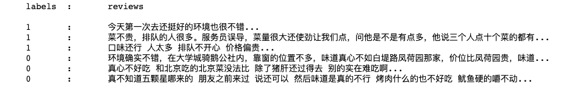

正向，负向评论各1000条.

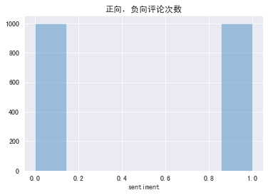

评论的长度分布如下：

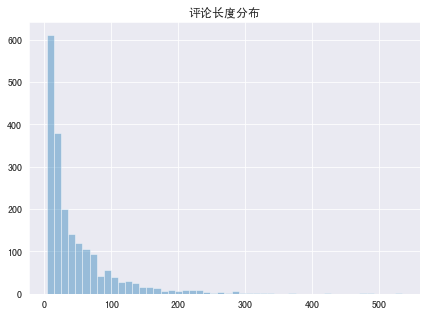

在所有评论使用频率最高的20个词

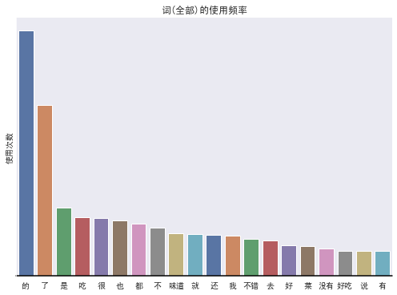

在正向评论使用频率最高的20个词

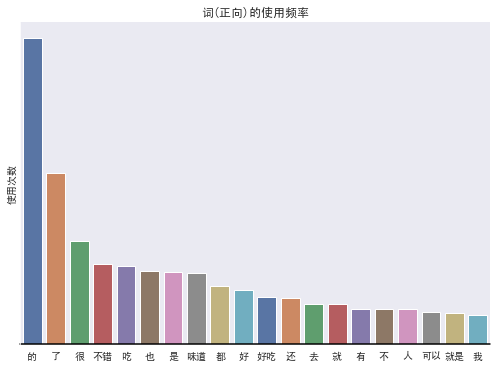

在负向评论使用频率最高的20个词

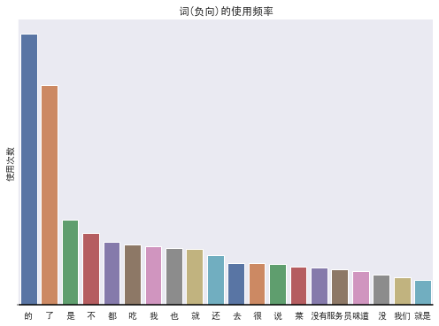

可以看到，正面和负面评论中都经常出现诸如“的”之类的常用词。 我们真正想要的不是在正面或负面评论中找到最常见的词，而是在正面评论中比在负面评论中发现更多的词，反之亦然。 为此，计算正面和负面评论之间单词使用的*比例* 可能是比较好对特征。在对数取比率后，中性词将接近`0`，当词的比率趋近并高于`1`时，词将变得更正；当词的比率趋近并低于`-1`时，词将变得更负。

### 算法和技术

教会计算机如何理解一个句子并不是一件容易的事情，并且让计算机判断这句话是带有正向的情绪，还是负向的情绪更是不易。随着表示学习和深度神经网络式机器学习方法在自然语言处理中广泛应用，这类问题不再是触不可及。首先，什么是语言模型(Language Modeling)？语言模型就是计算一个句子的概率大小的模型。$$ P(\text{"我吃饭"}) > P(\text{"饭吃我"}) $$

语言模型发展大致有3个阶段，专家语法规则模型阶段，统计语言模型阶段，神经网络语言模型阶段。直到1980年代，大多数自然语言处理系统都基于复杂的手写规则集。但是，从1980年代后期开始，自然语言处理发生了一场革命，引入了用于语言处理的机器学习算法。由于计算能力的稳步提高，机器学习算法，隐马尔可夫模型引入自然语言处理，越来越多的研究集中在统计模型上。对于语言序列 ${w_1, w_2, \dots, w_n}$ ，语言模型就是计算该序列的概率，即 $$P({w_1, w_2, \dots, w_n})$$ 。统计语言模型通过对句子的概率分布进行建模，概率高的语句比概率低的语句更为合理。在实现中，通过给定的上文来预测句子的下一个词， 如果预测的词和下一个词是一致（该词在上文的前提下出现的概率比其它词概率要高），那么上文+该词出现的概率就会比上文+其他词词的概率要更大，上文+该词更为合理。
首先，由链式法则(chain rule)可以得到

$$ P(w_1, w_2, \dots, w_{i-1}) = P(w_1)P(w_2|w_1)\cdots P(w_n|w_1,\dots, w_{n-1})$$

引入马尔可夫假设(Markov assumption)，即假设当前词出现的概率只依赖于前 $n-1$ 个词，可以得到

$$ P(w_i | w_1, w_2, \dots, w_{i-1}) = P(w_i|w_{i-n+1}, \dots, w_{i-1})$$

基于上式，定义 n-gram 语言模型如下：

${n=1}$ unigram:$$ P(w_1, w_2, \dots, w_{i-1}) = \prod_{i=0}^{n}P(w_i)$$

${n=2}$ bigram:$$ P(w_1, w_2, \dots, w_{i-1}) = \prod_{i=0}^{n}P(w_i|w_{i-1})$$

${n=3}$ trigram:$$ P(w_1, w_2, \dots, w_{i-1}) = \prod_{i=0}^{n}P(w_i|w_{i-2}, w_{i-1})$$

n-gram是典型的统计语言模型，它假设，当前词的出现只与前面 ${n-1}$个词相关，而与其它任何词都不相关，整句的概率就是各个词出现概率的乘积。其中一个问题是，在计算每一个词出现的概率时，随着${n}$的提升，更多的前置信息量，可以增加当前词的预测更加准确，但是当${n}$过大时会出现稀疏问题，导致很多词的概率值为0，为解决这一问题，提出了bigram 或 trigram，这就使得 n-gram 无法获得上文的长时依赖。另一方面 n-gram 只是基于频次进行统计，没有足够的泛化能力。 

2003年 Bengio 提出了神经网络语言模型( neural network language model, NNLM)。提出了词向量的概念，代替 n-gram 所使用离散变量(高维)，采用连续变量(具有一定维度的实数向量)来进行单词的表示，解决了维度爆炸的问题，同时通过词向量可获取词之间的相似性。但是，通过前馈神经网络来训练语言模型，缺点就是其中的参数过多，计算量较大，同时softmax输出层计算量也过大。由于递归神经网络（RNN）架构的出现，研究人员开始在训练语言模型使用RNN，即RNNLM，任务是通过上文来预测下一个词，由于RNN在处理序列数据方面的优势，使用隐藏层的状态机获取到上下文语境信息，对比NNLM可以捕获更长的依赖，在实验中取得了更好的效果。RNNLM超参数少，通用性较强。但由于RNN存在梯度衰退问题，使得其很难捕获更长距离的依赖信息。

LSTM模型

长短期记忆模型（[LSTM](https://en.wikipedia.org/wiki/Long_short-term_memory)）是针对递归神经网络（RNN）架构在梯度衰退问题上提出的解决方案。递归神经网络使用backpropagation through time, 主要困难在于梯度衰退问题，即在训练过程中反向传播时梯度会衰减或呈指数增长。Hochreiter和Schmidhuber[9]提出了一种称为长短期记忆（LSTM）的替代解决方案，修改了网络体系结构，从而明确避免了梯度消失的问题，而训练算法则保持不变。作者解释了梯度在反向传播中问题，当神经网络的误差函数的梯度通过一个神经网络的单元传播回去时，它就会按一定因子进行缩放。在一般情况下，该因子要么大于1，要么小于1。结果是在递归神经网络中，梯度会在反向传播过程中呈指数衰减或增加。为了避免这种缩放效应，作者重新设计了神经网络的单元，将其相应的缩放因子固定为一个， 向LSTM单元增加了几个所谓的门控单元。参见[6]。 实现参见Pytorch[13]。

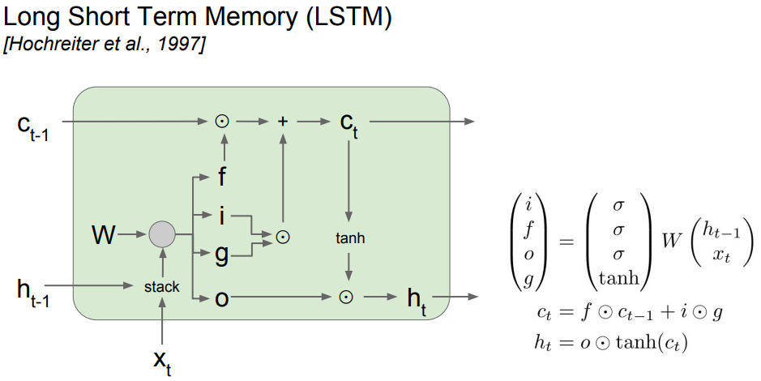

BERT预训练模型的迁移学习

词向量的具体实现Word2vec中的CBOW和skip-gram，CBOW是通过窗口大小内的上下文预测中心词，而skip-gram恰恰相反，是通过输入的中心词预测窗口大小内的上下文。Glove是另一种词向量的实现，属于统计语言模型，也是通过统计学知识来训练词向量。但是学习这种高质量的词向量表示形式可能会比较有挑战。理想情况下，应该同时建模（1）词句具有的复杂特征（例如语法和语义），以及（2）在不同语境中词义变化（即建模多义性）[4]。如果使用softmax函数，该模型可能很难训练，因为类别数太大（词汇量大）。 尽管提出了诸如负采样（Negative Sampling）和分层softmax（HS）的近似算法来解决此问题，但仍会发生其他问题。

ELMo使用多层双向的LSTM（一般都是使用两层）来训练语言模型，任务是利用上下文来预测当前词，上文信息通过正向的LSTM获得，下文信息通过反向的LSTM获得，这种双向是一种弱双向性，因此获得的不是真正的上下文信息。但在这种想法的影响下，BERT通过Transformer代替LSTM来训练语言模型。BERT使用Self-attention Encoder of Transformer体系结构作为其模型基础。它使用了Multi-Head Attention block一种基于一些键和查询来计算一组值（信息）的相关性的方法。基本上，注意力（Attention）机制用作模型基于当前正在处理的内容关注相关信息的一种方式。传统上，注意力权重是处理解码器状态（查询）时编码器隐藏状态（值）的相关性，并基于编码器隐藏状态（键）和解码器隐藏状态（查询）进行计算。传统的注意机制通过允许解码器访问整个输入序列，在很大程度上解决了依赖性。Transformer的新颖思想是将这种机制也扩展到处理输入和输出语句。为什么不让编码器和解码器一次看到全部输入序列，而直接使用注意力对这些依赖关系建模，而不是使用RNN从左到右移动呢？这是Transformer背后的基本思想。

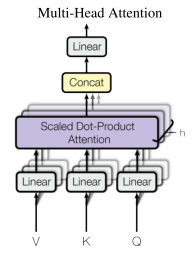

Transformer包含多个attention blocks，该层将序列映射到序列，就像LSTM一样，只是它不是重复性的并且使用一组不同的转换。因此，如果输入n个单词的序列，则输出将是n个张量的序列。作为输入，BERT接受Token Embedding以及提供一些关键元数据的几个其他Embedding。这些嵌入之一是Position Embedding。 Transformer体系结构的一个局限性是与RNN不同，它不考虑输入的顺序（即，如果输入的第一个和最后一个标记是相同的单词，则它们将完全相同地对待）。为了克服这个问题，BERT学习并使用Position Embedding来表达单词在句子中的位置。在将它们输入模型之前，将这些Embedding添加到Token Embedding中。

BERT也将Segment Embedding作为输入。可以在句子对上对BERT进行训练，以完成将句子对作为输入的任务（例如问题回答和自然语言推论）。它为第一和第二个句子学习了唯一的Embedding，以帮助模型区分句子。

BERT的输入方案总结如下：

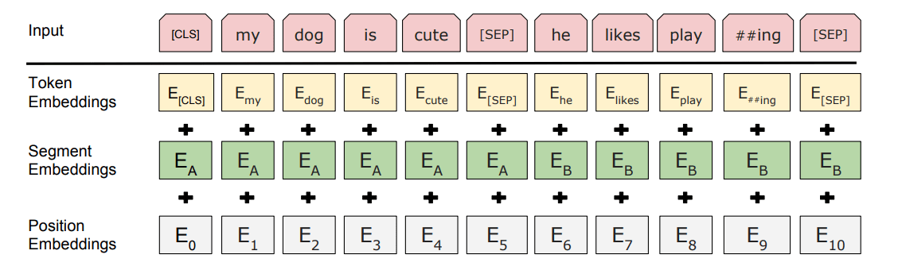

EBRT语言模型

BERT在训练语言模型上使用屏蔽[MASK] Token, 最简单的方法是用[MASK] Token随机替换一定百分比的单词，并要求模型预测屏蔽Token。在大多数情况下，这就是BERT训练的方法。对于每个示例，随机地均匀选择15％的Token以将其屏蔽。

这种方法的问题在于，该模型仅尝试预测何时[MASK]Token出现在输入中。这意味着当输入Token不是[MASK]Token时，模型可以“松弛”，这意味着输入Token的隐藏状态可能不像它可能的那样丰富。我们真正希望模型执行的操作是尝试预测正确的Token，而不管输入中存在什么Token。

为了解决此问题，作者有时将句子中的单词替换为随机单词而不是[MASK]标记。尽管必须谨慎行事，因为随机交换单词是一种非常强烈的噪声形式，可能会混淆模型并降低结果。这就是为什么BERT只交换选择用于屏蔽的15％Token中的10％（总共占所有Token的1.5％），而保留10％的Token完好无损（不屏蔽或交换它们）。剩余的80％实际上已被[MASK]Token取代。

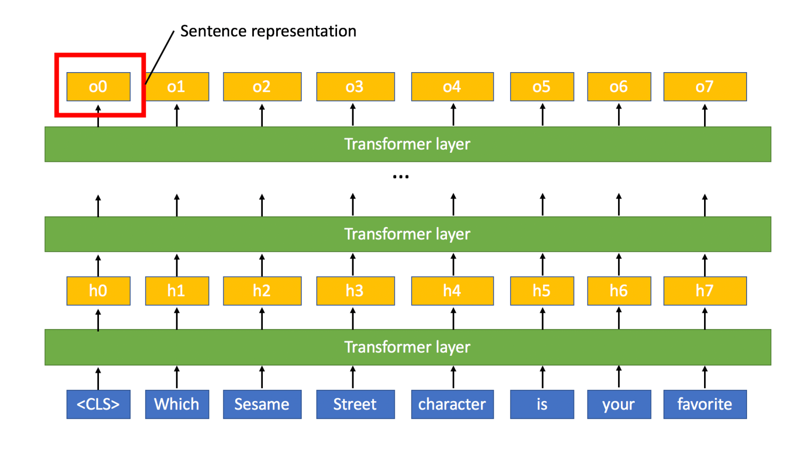

下一句预测训练

除了掩盖语言建模之外，BERT还使用下一个句子预测任务对需要了解两个句子之间的关系（例如问题回答和自然语言推理）的任务进行预训练。当使用两个句子作为输入时，BERT用特殊的[SEP]标记分隔句子。在训练过程中，向BERT提供了两个句子，第二个句子之后的50％的时间是第二个句子之后的50％的时间，这是一个随机抽样的句子。然后需要BERT预测第二句话是否是随机的。

微调

如前所述，BERT编码器会产生一系列隐藏状态。对于分类任务，最终需要将该序列简化为单个向量。有多种方法可以将此序列转换为句子的单个向量表示。一个是最大/平均池。另一个正在引起注意。然而，作者选择了一种更简单的方法：简单地获取对应于第一个标记的隐藏状态。为了使该合并方案有效，BERT在每个句子的开头添加了一个[CLS]令牌（“分类”的缩写）（本质上就像一个句子开始令牌）。然后可以将此句子表示形式输入到任意分类器中。分类器和BERT可以一起进行微调，也可以在从BERT提取的固定特征之上调整分类器。

### 基准模型

1. 选取支持向量机模型（SVM）为分类器，创建Pipeline，以原始的评论为输入，使用TF-IDF进行特征提取。模型预测的准确率仅为56%。
2. 使用Hyperopt库[14]分别使用朴素贝叶斯模型（Naive Bayes）和K最近邻模型（KNN）为分类器，以原始评论为输入。朴素贝叶斯模型的预测准确率为59%。

以上可以说明，虽然支持向量机模型，朴素贝叶斯模型，都是非常强大的分类器模型，但是如果没有好的输入数据的特征抽取作基础，仅仅依赖单纯的词作为输入数据的特征远远不够。LSTM模型之所以表现比传统的模型好，其主要的原因，我想是它对句子的特征提取有独到之处。而BERT模型对特征抽取更上一层楼。

## III. 方法

### 数据预处理

首先对于每个评论，
1. 根据CJK统一表意文字(CJK Unified Ideographs)的Unicode块提取有效的汉字字符。
2. 进行分词，使用[结巴](https://github.com/fxsjy/jieba)。
3. 创建字典。
4. 根据字典的索引将词的字符表示转换成整数数值表示。
5. 整个评论转换成整数数组作为模型的输入。

训练集，验证集，测试集分割如下：
* 模型在训练集上进行训练，在验证集是查看训练的效果。训练好的模型在测试集查看模型的泛化能力。
* LSTM建模，
    * 训练集 1600
    * 验证集 200
    * 测试集 200
* BERT预训练模型迁移学习，
    * 训练集 1620
    * 验证集 180
    * 测试集 200

### 执行过程

LSTM建模

首先, 将句子输入到嵌入层(embedding layer)。为什么需要一个嵌入层，对近万个中文词汇，需要比单热编码矢量更有效的表示的输入数据。这里使用一个嵌入层并让网络自行学习到一个词向量作为下一层的输入。*在这种情况下，嵌入层用于降维，而不是用于学习语义表示*。将输入的词输入到嵌入层后，新的嵌入将传递到LSTM单元。LSTM单元将向网络添加*循环*连接，并使我们能够提取有关词在句子中的“顺序”的信息。最后, LSTM层输出到sigmoid层。因为我们是二元分类问题，Sigmoid function输出0-1之间到值。

首先，定义超参数。
* `vocab_size`：词汇量或输入的值，9524。
* `output_size`：需输出的大小；0, 1 二元分类。
* `embedding_dim`：嵌入查找表中的列数；400。
* `hidden_dim`：LSTM单元的隐藏层的神经单元的个数。256个。
* `n_layers`：网络中LSTM的层数。2层

BERT预训练模型

使用Fastai[15] 作为训练框架。Fastai使用 Spacy Tokenizer作为底层库。不适于中文的处理，需要重新定义一个新的BertFastaiTokenizer，来替换Spacy。另外，在每一句话前后，根据 BERT的要求，加入起始的[CLS]和结束位置的[SEP]，这两个特殊Token 。

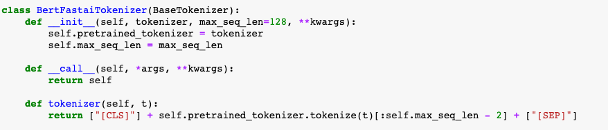

替换处理后的模型输入数据

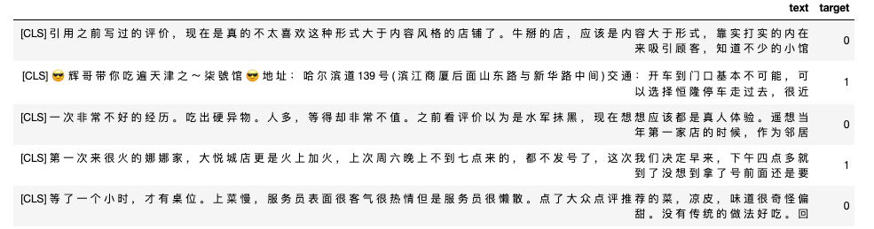

使用Fastai Learner learning rate finder.

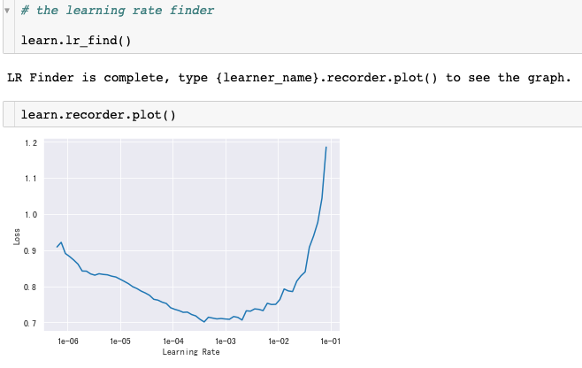

训练过程如下

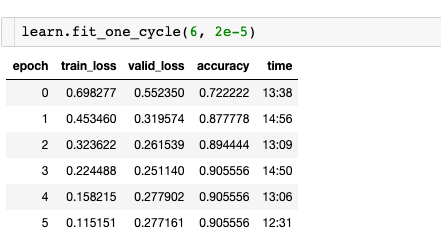

### 完善

1. LSTM cell可以用双向 biLSTM cell替代。
2. 在LSTM模型中超参数`embedding_dim`， `hidden_dim`。可以微调这两个参数进行训练查看测试效果。

## IV. 结果

### 模型的评价与验证

LSTM模型结果如下

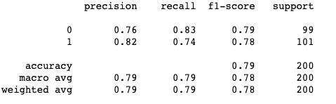

BERT预训练模型结果如下

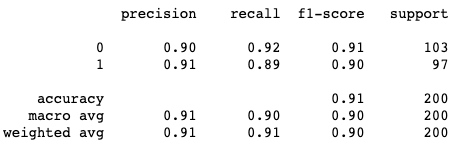

### 合理性分析

BERT预训练模型上的迁移学习测试结果比LSTM模型测试结果提高近10%。

LSTM对于*“这家的环境不差，但是菜不怎么好吃。”*前部分正向，后部分负向比较复杂的情感判断，偏向于前半段。

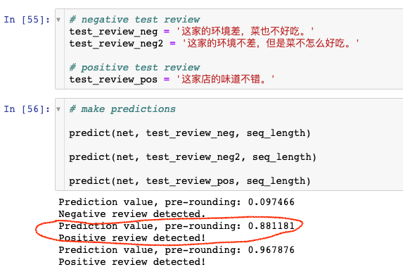

BERT对于*“这家的环境不差，但是菜不怎么好吃。”*前部分正向，后部分负向比较复杂的情感判断，有总体的判断。

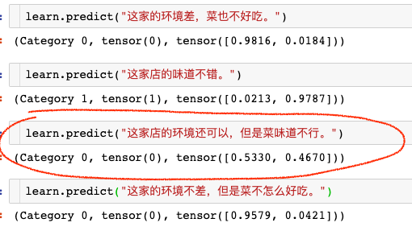

## V. 项目结论

### 结果可视化

通过LSTM模型Embedding提取出来的权重，把一下词的样本通过TSNE映射的2维空间，可以看出LSTM Embedding层功能只是降维，词向量没有明显的语义上的关联。

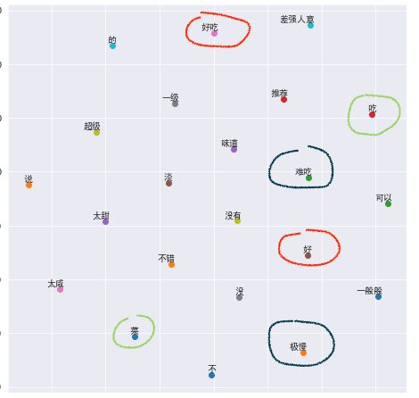

表示正向的“好吃“， ”好“等，与表示负向的”难吃“，”极慢“，和中性的词如”吃“，”菜“，在向量空间上没有明显的关联。

### 对项目的思考

在使用ElMo和BERT之类的方法之前，NLP中的预训练仅限于诸如word2vec和GloVe之类的词向量。词向量将每个单词映射为一个向量，表示一定的含义（例如，“King”的向量将包含有关身份，性别等的信息）。词向量通常在大型的，未标记的语料库（例如Wikipedia）上进行训练，然后用有标签的数据上训练模型以进行下游任务，例如情感分析。这允许下游模型利用从较大数据集中学习到的语言信息。虽然词向量在各种任务中都普遍有用，但同时也有很多局限性。其一是词向量模型通常不是很强大。如Word2vec是比较浅的语言模型，词向量可以捕获的内容因此受到了一定的限制。其二，一个关键局限性是词向量模型没有考虑上下文。例如，“方便”一词的含义在不同的上下文有所不同（例如，“晚餐只吃了方便面”与“我要方便方便”）。而传统的词向量方法仅为每个词分配一个向量。

这些局限性促使人们使用深度语言模型（使用类似LSTM体系结构的语言模型）进行**迁移学习**。这些方法不仅训练模型为每个词映射一个向量，还训练了一个复杂的深度神经网络，根据整个句子/上下文将向量映射到每个单词。基本思想是训练深度语言模型，在下游任务中使用语言模型学习的表示形式。BERT预训练模型进行迁移学习就是一个例证。

### 需要作出的改进

在计算机视觉领域，ImageNet上训练的模型，进行**迁移学习**不是一个新概念。在ImageNet上训练的深度神经网络模型，通过对每一层神经网络学习到的特征进行研究，发现它们可以适用于一般通用任务。较低的层学习到的特征，实际上是对*边缘*等物体的某些基础特征进行建模，而较高的层则对较高级的概念如*图案*， *整个构件*或*对象的全貌*进行建模。对于物体的边缘，结构以及视觉构成方面的知识与许多计算机视觉任务相关，这说明了为什么可以保留这些特定的层。所以说，模型在ImageNet的数据集学习到的关键属性有一定泛化能力，可以应用到为许多新问题中。[19]

同样地，迁移学习在自然语言处理上同样适用吗？Jeremy Howard(Fastai Founder)等人[8]提出的一种新方法，通用语言模型微调（ULMFiT），该方法可以解决这些问题并为任何NLP任务提供强大的归纳式传输学习，它类似于对ImageNet模型的微调，在多种语言上取得了骄人的成绩。基于BERT预训练模型就是在此鼓励下的一个简单的尝试。另外对于强大BERT，ULMFiT， ELMo我只是管中窥豹，需要学习理解的地方还比较多。

## 参考文献

1. [文本情感分析](https://en.wikipedia.org/wiki/Sentiment_analysis)
2. [自然语言处理](https://en.wikipedia.org/wiki/Natural_language_processing)
3. Tomas Mikolov [Distributed Representations of Words and Phrases and their Compositionality](http://papers.nips.cc/paper/5021-distributed-representations-of-words-and-phrases-and-their-compositionality.pdf)
4. Matthew E. Peters [Deep contextualized word representations](https://arxiv.org/pdf/1802.05365.pdf) 
5. Jacob Devlin [BERT: Pre-training of Deep Bidirectional Transformers for Language Understanding](https://arxiv.org/pdf/1810.04805.pdf)
6. Andrej Karpathy [The Unreasonable Effectiveness of Recurrent Neural Networks]()
7. Keita Kurita [A Tutorial to Fine-Tuning BERT with Fast AI](https://mlexplained.com/2019/05/13/a-tutorial-to-fine-tuning-bert-with-fast-ai/)
8. Jeremy Howard [Universal Language Model Fine-tuning for Text Classification](https://arxiv.org/pdf/1801.06146.pdf)
9. [NLP之语言模型](https://www.cnblogs.com/dyl222/p/11005948.html)
10. 李宏毅 [ELMO, BERT, GPT](https://www.youtube.com/watch?v=UYPa347-DdE&pbjreload=10)
11. Hochreiter, S., Schmidhuber, J., “Long Short-Term Memory”, Neural Computation 9 (8), 1997, pp. 1735–1780
12. sundermeyer [LSTM Neural Networks for Language Modeling](http://www-i6.informatik.rwth-aachen.de/publications/download/820/SundermeyerMartinSchl%5C%7Bu%5C%7DterRalfNeyHermann--LSTMNeuralNetworksforLanguageModeling--2012.pdf)
13. [Pytorch LSTM](https://pytorch.org/docs/stable/nn.html#lstm)
14. Kris Wright [Parameter Tuning with Hyperopt](https://medium.com/district-data-labs/parameter-tuning-with-hyperopt-faa86acdfdce)
15. Fastai [train](https://docs.fast.ai/training.html)
16. BERT Transformers[BertTokenizer](https://huggingface.co/transformers/model_doc/bert.html?highlight=berttokenizer)
17. Hugging Face https://github.com/huggingface/transformers
18. 王树义 [如何在fast.ai用BERT做中文文本分类](http://blog.sciencenet.cn/blog-377709-1191558.html)
19. Sebastain Ruder [NLP's ImageNet moment has arrived](https://thegradient.pub/nlp-imagenet/)
